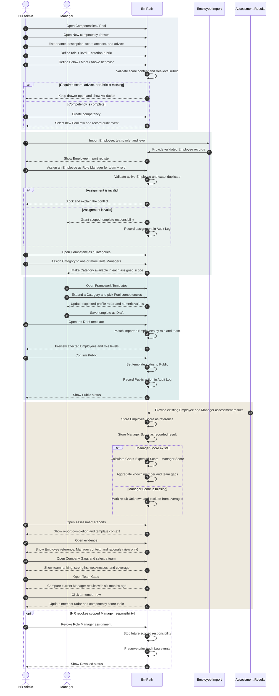

# En-Path HR Admin Sequence Diagram

This diagram covers competency governance, scoped Manager delegation, public Framework Templates, and assessment reporting for HR Admin.

## Invariants

- Competencies live in one flat Pool; Categories organize Pool selections inside Framework Templates.
- Every competency stores a description, score anchor, and improvement advice for each active shared score.
- Role-level rubrics bind role, role level, evaluation criterion, and Below / Meet / Above Expectation behavior.
- Shared score anchors and role-level rubrics remain separate concepts.
- Template Categories are collapsible presentation sections; collapse state does not change composition.
- A Category may be assigned to multiple active Role Manager scopes.
- HR and appropriately scoped Managers may compose Framework Templates.
- HR imports Employee team, role, and level data before role assignment and impact preview.
- Templates move directly between Draft and Public in this prototype; there is no Framework Review route.
- Public confirmation includes affected imported Employees and role levels.
- Making a template Public is not tied to a performance-review period.
- Assessment Reports consume existing assessment results; HR does not generate assessments in this prototype.
- Evidence Review is view-only for HR Admin.
- Manager Score is recorded. Employee Score is reference-only.
- `Gap = Expected Score - Manager Score`; missing Manager Score produces `Unknown`.
- Prototype fixtures use anonymous labels and never reuse persona or interview identities.
- The Audit Log is the governance record; there is no separate Version History page.
